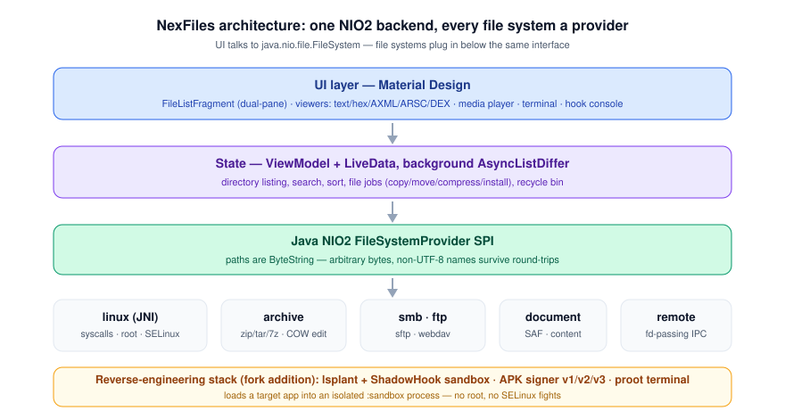
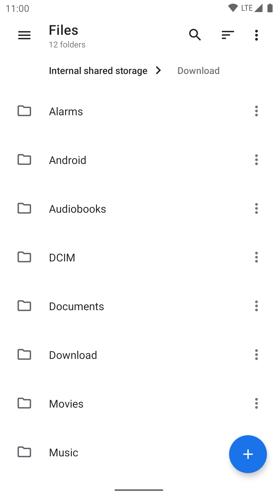
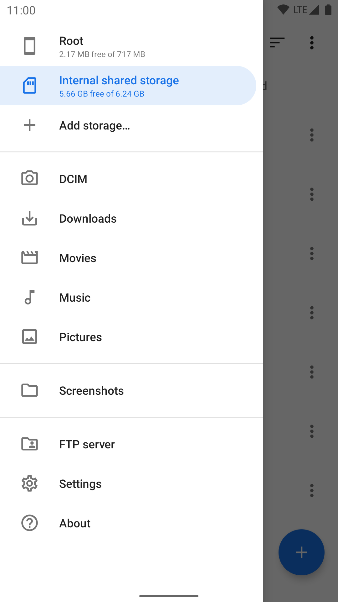
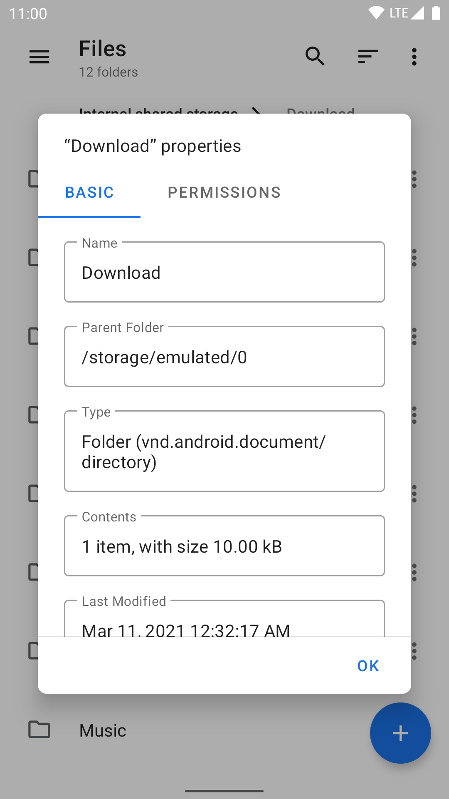
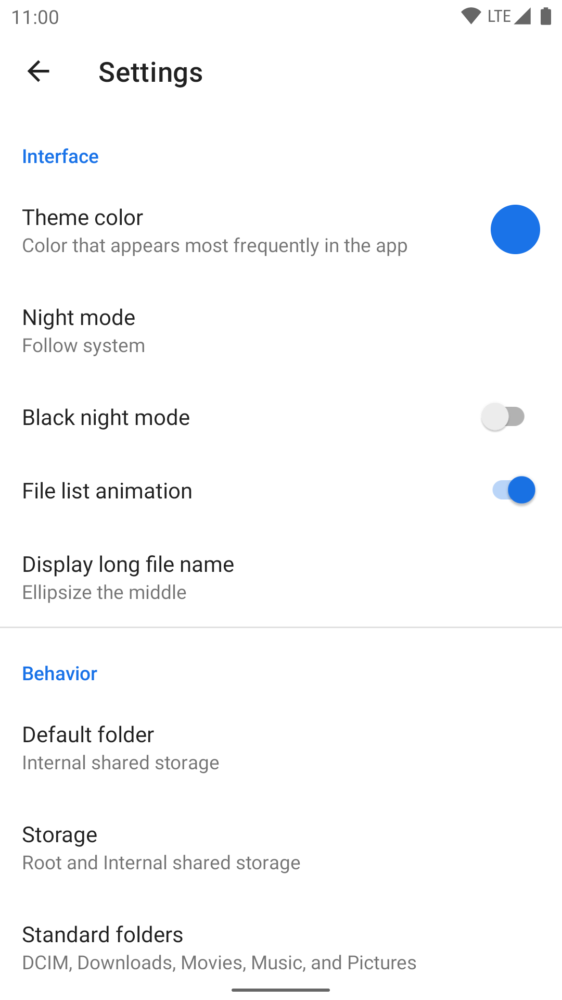
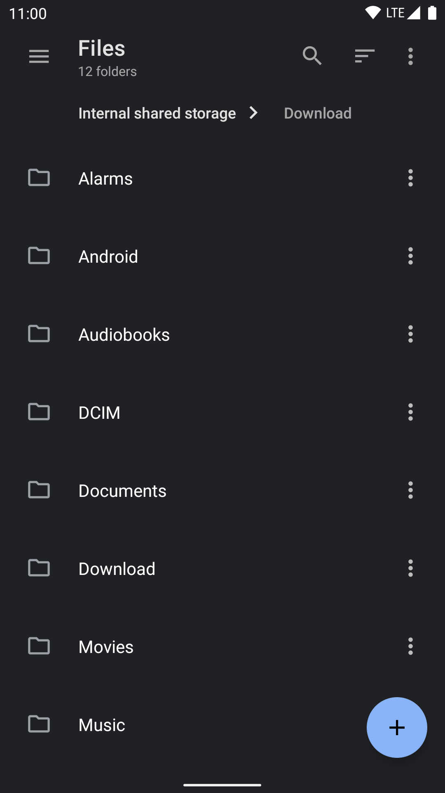
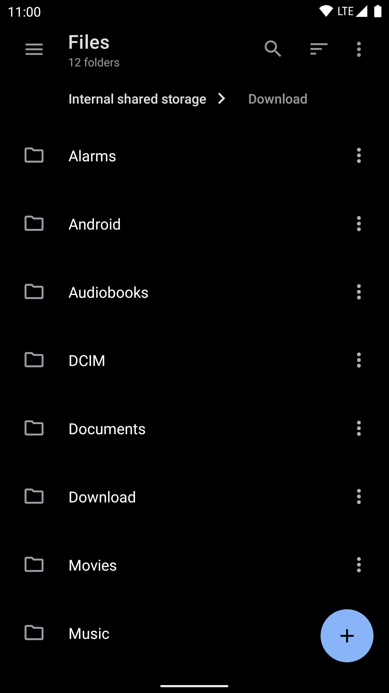
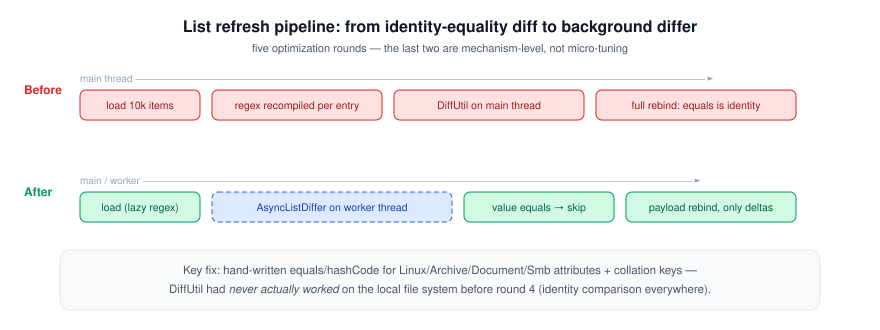
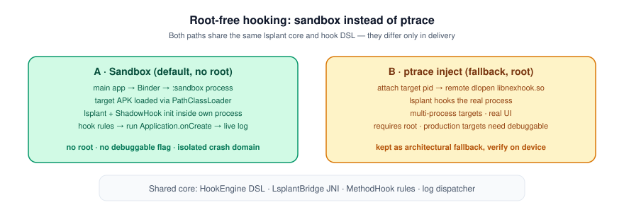

# NexFiles

**An open-source, Linux-aware file manager for Android — with a built-in reverse-engineering toolkit.**

[](https://github.com/shiaho777/NexFiles/actions/workflows/android.yml)
[](LICENSE)
[](README.md)
[](README_zh-CN.md)

[本文中文版](README_zh-CN.md)

> NexFiles is an independent project forked from [Material Files](https://github.com/zhanghai/MaterialFiles) by [Hai Zhang](https://github.com/zhanghai).
> The core file manager (NIO2 backend, Material Design UI) originates from that excellent project;
> everything described in [What NexFiles adds](#what-nexfiles-adds) below is developed on top of it in this repository.

<p align="center">
  
</p>

## Features

- **Clean Material Design** — follows the guidelines with attention to detail: breadcrumbs, dual-pane on tablets, customizable colors and true-black night mode.
- **Linux-aware** — like [Nautilus](https://apps.gnome.org/Nautilus/): symbolic links, file permissions and SELinux context are first-class. Backed by Linux syscalls via JNI, not yet another [`ls` parser](https://news.ycombinator.com/item?id=7994720), with paths stored as raw bytes so non-UTF-8 filenames survive.
- **Everywhere files live** — 11 file system providers: local (syscall), root, archive (zip/tar/7z), FTP, SFTP, SMB, WebDAV, SAF/documents, content URIs, and a remote fd-passing provider.
- **Robust engineering** — built on the Java NIO2 File API and ViewModel/LiveData, with errors, file conflicts and foreground/background state handled properly.

## What NexFiles adds

Material Files was a great clean-slate file manager. NexFiles extends it into a tool for people who
also look *inside* files:

- **Runtime hooking without root** — loads a target app into an isolated `:sandbox` process and hooks
  its methods there with [lsplant](https://github.com/LSPosed/LSPlant) + [ShadowHook](https://github.com/bytedance/android-inline-hook).
  No root, no debuggable flag, no SELinux fights — target crashes stay in the sandbox. A ptrace-based
  injection path is kept as a root fallback. See [hook paths](#the-sandbox-hooking-approach).
- **Built-in terminal** — real PTY (native `forkpty`) + VT100 emulator, with Alpine/Debian rootfs via proot, and a Shizuku path running as shell UID.
- **APK tooling** — signature viewer (v1/v2/v3/v3.1 schemes with X.509 details and fingerprints), APK signer (v1/v2/v3), signature stripper, split-APK installer (`.apks`/`.xapk`/`.apkm`), and installed-app extraction.
- **Deep viewers & editors** — text editor with in-file find, hex editor, AXML and ARSC inspectors, DEX browser/editor (string pool, const-string patching via dexlib2), image and media viewers.
- **Power-user file management** — recursive search with regex/wildcards + type/size/time filters, in-archive editing (copy-on-write overlay), recycle bin, batch checksums (MD5/SHA-1/SHA-256), batch rename, dual-pane layout, FTP and WebDAV servers to share files out.
- **Performance work** — five documented optimization rounds, including fixing DiffUtil equality semantics that had never actually worked on the local file system, and a background async list differ.

<p align="center">
  
</p>

## Preview

<p>
    
    
</p>

## Architecture

The frontend is deliberately boring: `ViewModel` + `LiveData` + `RecyclerView`, no Compose. The
interesting decisions live in the backend — every file system is a real
`java.nio.file.FileSystemProvider`, so file operations compose across providers (copy from SFTP into
an archive, checksum a root-owned file) with one code path.

<p align="center">
  
</p>

### The sandbox hooking approach

Global root-free hooking by injecting Zygote is sealed off by SELinux `neverallow` on Android 10–14 —
that is an OS boundary, not an engineering problem. NexFiles takes the road MT Manager and LSPosed
did not: instead of injecting into someone else's process, it loads the *target's* code into its own
sandboxed process, where lsplant has full `ArtMethod` access with no special privileges at all.

<p align="center">
  
</p>

## Building

```sh
git clone https://github.com/shiaho777/NexFiles.git
cd NexFiles
./gradlew assembleDebug
```

- JDK 17+, Android SDK 36, NDK (for the JNI parts: syscalls, terminal PTY, hook bridge).
- The terminal's proot binary must be provided manually — see `jniLibs/README-proot.md`.
- Signing: copy `signing.properties.example` to `signing.properties` (optional for debug builds).

CI builds `assembleDebug lintVitalRelease` on every push ([workflow](.github/workflows/android.yml)).

## Attribution & License

NexFiles is **GPLv3**, same as upstream. All credit for the original file manager design and
implementation belongs to [Hai Zhang](https://github.com/zhanghai)'s
[Material Files](https://github.com/zhanghai/MaterialFiles) — this project stands on that work.

    Copyright (C) 2018 Hai Zhang (Material Files)
    Copyright (C) NexFiles contributors

    This program is free software: you can redistribute it and/or modify
    it under the terms of the GNU General Public License as published by
    the Free Software Foundation, either version 3 of the License, or
    (at your option) any later version.

    This program is distributed in the hope that it will be useful,
    but WITHOUT ANY WARRANTY; without even the implied warranty of
    MERCHANTABILITY or FITNESS FOR A PARTICULAR PURPOSE.  See the
    GNU General Public License for more details.

    You should have received a copy of the GNU General Public License
    along with this program.  If not, see <https://www.gnu.org/licenses/>.
